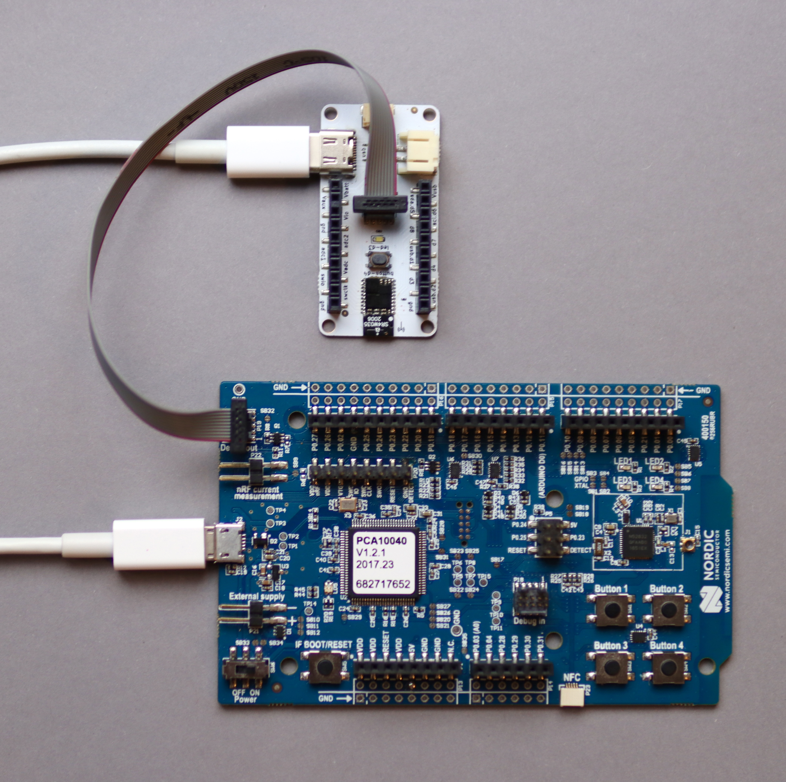

# S1 Blinky Demo

A minimal blinky example that runs on both the [S1 module](https://www.siliconwitchery.com/module), and the [S1 Popout Board](https://github.com/siliconwitchery/s1-popout-board).


## Building the project

To begin, you will need to clone this repository to your computer.

``` bash
git clone --recurse-submodules https://github.com/siliconwitchery/s1-blinky-demo.git
cd s1-blinky-demo
```

If you haven't already, set up these [tools](https://github.com/siliconwitchery/s1-sdk/blob/main/README.md#setting-up-the-tools) in order to build the project.

You should then be able to run `make`. *Be sure to include the path to your NRF SDK folder*.

``` bash
make build-verilog NRF_SDK_PATH=${HOME}/nRF5_SDK
make flash NRF_SDK_PATH=${HOME}/nRF5_SDK
```

The first `make` command will build the Verilog project, and convert the binary file into a header file. The nRF application transfers this binary to the FPGA after boot up. In your application, you could download this binary dynamically over Bluetooth rather than storing it within the flash of the nRF chip.

The second `make` command builds the nRF code, and flashes the module using a J-Link debugger. If you don't have a J-Link, you can also use an [nRF52 devkit](https://www.nordicsemi.com/Products/Development-hardware/nrf52-dk) and a 10pin debug cable to flash your board.



## Creating your own project

This example is a great starting point for your own projects.

Here's an overview of the project structure.

- `s1-sdk` - This folder is our main S1 SDK. We add this folder to our projects as a submodule which makes it easy to update and keep track of versions. It includes all the APIs for interacting with the Flash Memory, Power IC and FPGA. It also includes the core `s1.mk` makefile which your `Makefile` calls when building projects.

- `Makefile` - This is a customizable makefile. In here you can adjust the project name, include more application .c/.h files and add optimization settings. You can also configure other build tasks in here. For instance, we've created one called `build-verilog` which builds the FPGA binary.

- `main.c` - This is where you'd put your nRF application code. In this example, we demonstrate how to create a state machine that boots up the S1 module, and then flashes the FPGA.

- `fpga_blinky.v` - In here is where you'll find the FPGA blinky. You could build any verilog files you wish from your own `Makefile`. This example shows you some of the basics for configuring the internal oscillator and setting outputs.

- `fpga_binfile.h` - When you call `make build-verilog`, the FPGA binary is built and is then converted into this header file. The nRF application flashes it to the chip on power up and runs the application. If you wanted to, you could load this binary dynamically over Bluetooth rather than hard-coding it into the nRF application code.

- `sdk_config.h` - This is the nRF SDK configuration file. It includes a lot of settings and can be extended to enable different peripherals and Bluetooth parameters on the nRF52 chip. It's best to read this in conjunction with the nRF SDK documentation and look at the examples in the nRF SDK itself where you'll find individual `sdk_config.h` files for each example.

- `.vscode` - These are some handy scripts for those of you who like to use VSCode. You can configure build tasks, debug launches and intellisense from within these templates.

That's it! If you have any questions, or if something is unclear, feel free to create an [issue](https://github.com/siliconwitchery/s1-blinky-demo/issues) and we'll try our best to improve it.